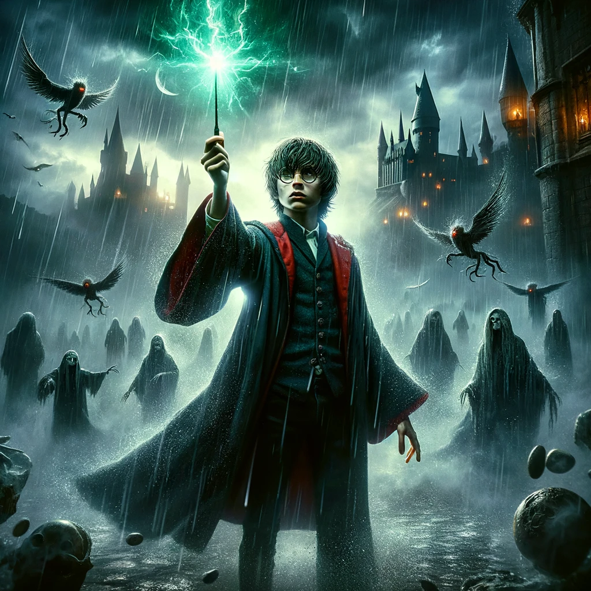

# small_GPT_hp
Using torch, built from scratc some small decoder only language models. Trained just on the texts from the Harry Potter novels.

This model can generate infinite Harry Potter-like text.

There are two models:
1. `small_GPT_hp_bpe_tokenizer.py` has a byte pair encoded tokenizer. Built the tokenizer off of similar structure as GPT-4 (thanks to Karpathy's minbpe)
   * This model produced the output `harry_potter_text_nano_GPT_all_books_bpe_tokenizer.txt` which at a glance is an improvement over the character level model's output. Similar word structure and word invention like that in the books.
2. `small_GPT_hp.py` has a small character level tokenizer. Simply mapped characters to integers.
   * This model produced the output `harry_potter_text_nano_GPT_char_level_tokenizer.txt` based on books 1 & 6 and `/harry_potter_text_nano_GPT_all_books.txt` was trained on all 7 novels. Looks kind of Harry Potterish.

<!--Create an image depicting a teenage wizard who attends school in a medieval style castle in a gloomy setting. The teenager has round spectacles, shaggy length hair, and a lightning bolt scar on his forehead. He is dressed in black robes with red accents. He carries a wand about 14 inches in length. Show him holding his wand high above his head with green light bursting forth from the end of his wand illuminating the dark and rainy space around him. There should also be a mystic thematic element to the image of large language models. Show the teenager surrounded by floating wraithlike creatures that feed on human happiness and generated terrible feelings of despair within any person in close proximity.-->
